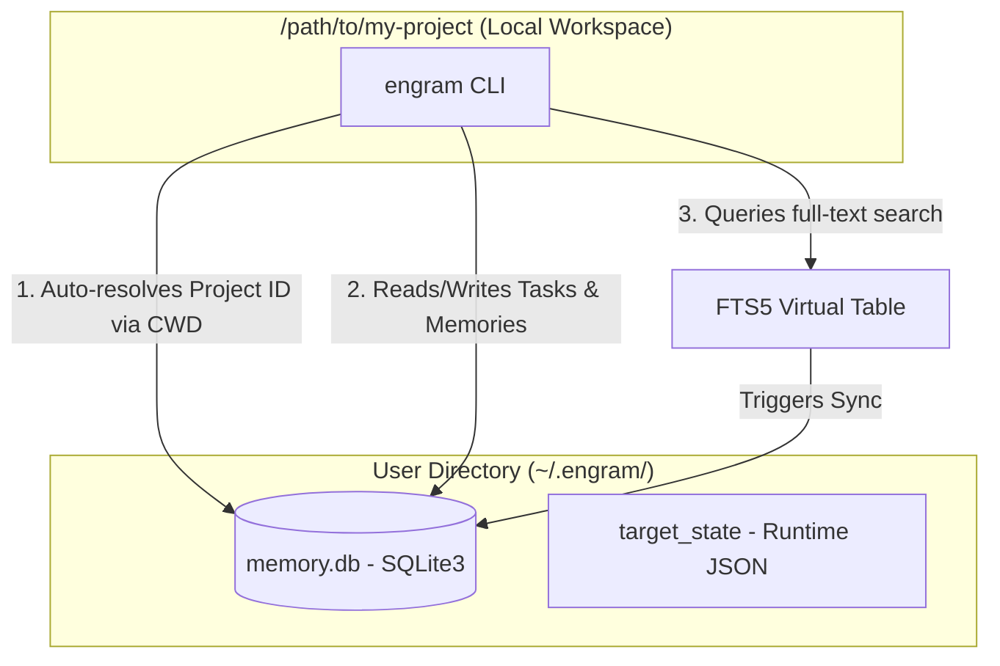

# Engram

> **Local-first, agent-agnostic persistent memory system for AI coding assistants and developers.**

[](https://www.python.org/)
[](https://github.com/astral-sh/ruff)
[](https://opensource.org/licenses/MIT)

Engram acts as a high-fidelity long-term memory layer for AI agents (and human developers) working in local codebases. It is designed to solve the **context window pollution** and **state loss** issues that occur when AI agents transition between sessions, restart, or hand off work to other models.

---

## 1. The Problem & The Solution

### The Problem
Modern LLM agents are highly capable but suffer from two core limitations:
1. **Short-Term Amnesia**: When an agent session terminates or crashes, all state, critical constraints, architectural decisions, and lessons learned are lost. The next agent starting in that repository is "blind" and must re-discover the workspace.
2. **Context Window Pollution**: Packing entire issue logs, historical plans, and database dumps into the LLM system prompt balloons token counts, slows down generation, increases API costs, and degrades agent focus.

### The Solution: Engram
Engram provides a zero-friction, lightning-fast CLI that acts as a local memory store. It binds project directories to a single, central SQLite database at `~/.engram/memory.db`.
When an agent starts a session, it runs `engram context startup` to fetch a tightly compressed, hyper-focused project context—containing only the project summary, last checkpoint, active task title, and pinned constraints—in **under 500 tokens**. The agent can then pull deep task details or search through decisions and lessons learned **on-demand**.

---

## 2. Architecture & System Flow

Engram maintains a clean separation between your local Git repositories and your persistent memory database. Memory survives repository moves, branches, and deletions.



---

## 3. Technology Stack & Rationale

* **Python 3.10+**: Standard, highly portable, and script-friendly scripting language that is natively understood and run by standard agent runners.
* **SQLite + FTS5**: Leverages SQLite's native full-text search module (`fts5`) via an external content table and database triggers. This yields sub-millisecond, relevance-ranked keyword search across notes, decisions, and lessons learned with **zero external service dependencies**.
* **Click**: Powers robust CLI command groups, structured options, and clean argument validation.
* **Rich**: Formats beautiful console tables, compact status badges, and styled text logs for humans, while outputting pure JSON with the `--json` flag for agents and tools.

---

## 4. Key Design Decisions

### Relevance-Ranked FTS5 Virtual Table
Instead of pulling full memories, Engram utilizes SQLite FTS5 index syncing. Triggers automatically mirror insertions and modifications of `memories` into a virtual search table. This enables agents to query history using simple, high-speed CLI commands without installing vector libraries or managing API keys.

### Session-Embedded Checkpoints
Rather than maintaining a separate table for workspace checkpoints, closing a session (`engram session close`) atomically packages the session goal, summary, next steps, and changed files into a single, high-fidelity checkpoint. The next session's `context startup` reads this checkpoint to resume immediately.

### Graceful Unicode Fallbacks
To prevent fatal `UnicodeEncodeError` crashes on legacy Windows consoles, Engram reconfigures `sys.stdout` and `sys.stderr` error handlers at CLI startup to fallback to printable ASCII equivalents (such as `?`) for unsupported Unicode symbols.

---

## 5. Quick Start

### Installation
Clone the repository and install it locally using [uv](https://github.com/astral-sh/uv):
```bash
git clone https://github.com/Sai937593/engram.git
cd engram
uv pip install -e .
```

### Typical Agent Workflow

#### 1. Initialize a Project
Bind a local repository directory to a new Engram project:
```bash
engram init --name "catalyst" --summary "Realtime lakehouse e-commerce platform"
```

#### 2. Claim a Task
Agents retrieve the highest-priority todo task automatically:
```bash
engram task next             # Returns the next highest-priority task
engram task start T-003       # Marks the task as in-progress
```

#### 3. Capture Knowledge as You Work
Log key decisions, lessons, or constraints during development:
```bash
# Add a persistent architectural decision
engram memory add "Use SQLite" --content "FTS5 allows fast local search without external dependencies" --type decision --tags "storage,arch"

# Log progress non-destructively
engram task note T-003 "Identified WAL mode requirement for concurrent writes"
```

#### 4. Close Session & Create Checkpoint
Close the active session by summarizing your work and outlining next steps:
```bash
engram task done T-003 --evidence "All unit tests pass. Branch pushed."
engram session close --summary "Implemented duplicate event simulation and WAL mode" --next-steps "Write integration tests for batch uploads"
```

#### 5. Cross-Session Resumption
In the next session, the agent runs one command to see exactly where to pick up:
```bash
engram context startup
```

---

## 6. Tradeoffs & Future Roadmap

### Tradeoffs
* **Local-First Isolation**: By keeping all state in a local `~/.engram/memory.db`, data remains 100% private, secure, and fast. However, it is not synchronized automatically across multiple development machines.
* **CLI-Driven Design**: Opting for a pure terminal interface ensures absolute compatibility with any agent runner, but sacrifices browser-based UI inspection.

### Future Roadmap
* **MCP Server Integration**: Exposing Engram tools via the Model Context Protocol (MCP) to allow agents to interact with memories directly without running CLI processes.
* **Cloud Backup / Synchronization**: Safe, encrypted background synchronization of the global SQLite database to personal cloud drives.
