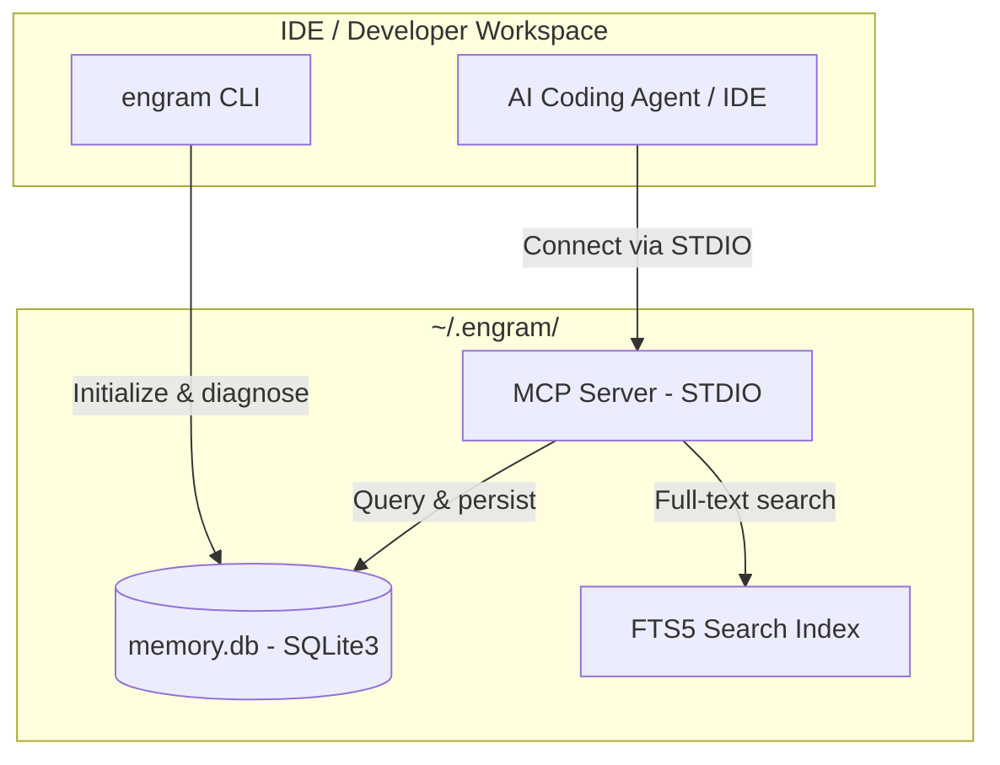

# Engram

> **Local-first, agent-agnostic persistent memory for AI coding assistants and developers.**

[](https://www.python.org/)
[](https://github.com/astral-sh/ruff)
[](https://opensource.org/licenses/MIT)
[](https://github.com/Sai937593/engram/actions/workflows/ci.yml)

Engram is a local-first, agent-agnostic persistent memory system for AI coding assistants and developers. It is built primarily around a **Model Context Protocol (MCP)** server that exposes project-level memory, tasks, phases, and workflows directly to AI agents, with a trimmed, lightweight companion CLI (`init`, `guide`, `db`) for initial setup and diagnostic utilities.

## The Problem

LLM coding agents are highly capable, but they usually lose critical context between sessions:

1. **Short-term amnesia:** constraints, decisions, task state, and lessons have to be rediscovered every turn.
2. **Context window pollution:** dumping all history into a prompt wastes tokens and makes agents less focused.

Engram solves this by giving agents a local MCP connection to pull only the context they need dynamically, keeping their workspace and context windows optimized.



## Features

- **MCP-First Architecture:** Exposes a robust Model Context Protocol (MCP) server providing 17 specialized tools and 4 local resources directly to AI agents.
- **Project-aware task tracking:** Programmatic task states (`todo`, `in-progress`, `done`, `blocked`, and `cancelled`) mapped automatically to the current workspace.
- **Task-scoped relevant file path hints:** Faster startup navigation for agents without code parsing overhead.
- **Persistent memories:** Categorized memories for notes, decisions, lessons, constraints, and reusable snippets.
- **Full-text search:** In-memory and global SQLite FTS5 search index over all captured memories.
- **Guardrail controls:** Multi-level project policy controls (L0 to L3) with explicit demotion audits.
- **Packaged user manual:** Interactive, console-rendered manual accessible via `engram guide`.

## Installation

Clone the repository and install it locally with `uv`:

```bash
git clone https://github.com/Sai937593/engram.git
cd engram
uv pip install -e ".[mcp]"
```

For development:

```bash
uv sync --extra dev
uv run pytest tests/ -v
```

## Quick Start

### 1. Initialize a Project

Run the initialization command from the repository root you want Engram to remember:

```bash
engram init --name "catalyst" --summary "Realtime lakehouse e-commerce platform"
```

### 2. Configure your MCP Client

Register `engram-mcp` with your agent client (Cursor, Codex, Claude Desktop, etc.). Supply the working directory as your initialized project root. See [Codex Setup Guide](docs/mcp-codex-setup.md) for comprehensive configuration examples.

### 3. Agent Tool Interaction

Once connected, your agent will programmatically invoke MCP tools and resources to manage state and retrieve context.

**Retrieve Startup Context:**
The agent automatically reads the `engram://startup` resource to load the active project summary, active tasks, guardrails, and memory candidates.

**Claim and Start a Task:**
The agent calls `engram_workflow_start` to claim the next task and establish the working branch.
Or they can create a task programmatically via the `engram_task_create` tool:
```json
{
  "title": "Implement WAL mode",
  "priority": "high",
  "acceptance": "Concurrent reads and writes are covered by tests"
}
```

**Record Knowledge:**
During development, the agent captures critical decisions or constraints via `engram_memory_create`:
```json
{
  "title": "Use SQLite FTS5",
  "content": "FTS5 gives local full-text search without external services.",
  "type": "decision"
}
```

**Finish the Task:**
Once verification passes, the agent calls `engram_workflow_finish` to stage changes, validate Conventional Commit constraints, run unit tests, commit, and mark the task as done.

---

## Admin and Utility Commands

The companion CLI is kept intentionally minimal and focused on system utilities:

```bash
engram init              # Bind the current working directory to an Engram project
engram guide             # Open the interactive packaged User Manual
engram db                # Inspect database path, size, and integrity health
```

---

## Core MCP Surface

Engram exposes the following interface to connected AI agents:

### Resources
- `engram://startup` — Active project status, active tasks, guardrails, and memory candidates.
- `engram://task/{task_id}/context` — Detailed task context including requirements, acceptance criteria, and relevant memories.
- `engram://snapshot` — A full Markdown snapshot of all tasks, phases, and memories in the project.
- `engram://handoff` — A focused Markdown summary of recent achievements, active blockers, and planned next steps.

### Primary Tools
- `engram_workflow_start` — Begin the next task, resolve context, and verify the worktree branch.
- `engram_workflow_finish` — Verify quality metrics, run test suites, commit changes, and complete the active task.
- `engram_task_create` / `engram_task_update` / `engram_task_note_append` — Programmatic task and evidence management.
- `engram_memory_create` / `engram_memory_search` — Add and query persistent project memory.
- `engram_phase_list` / `engram_phase_create` / `engram_phase_start` / `engram_phase_complete` — Multi-task milestone grouping and transition gates.

## Design Choices

- **Local first:** all data is stored in a user-level SQLite database at `~/.engram/memory.db`.
- **Zero repository clutter:** no planning files, task logs, or configuration blobs are committed to the codebase.
- **On-demand context:** agents pull specific details only when needed, minimizing prompt token consumption.

## License

MIT. See [LICENSE](LICENSE).
