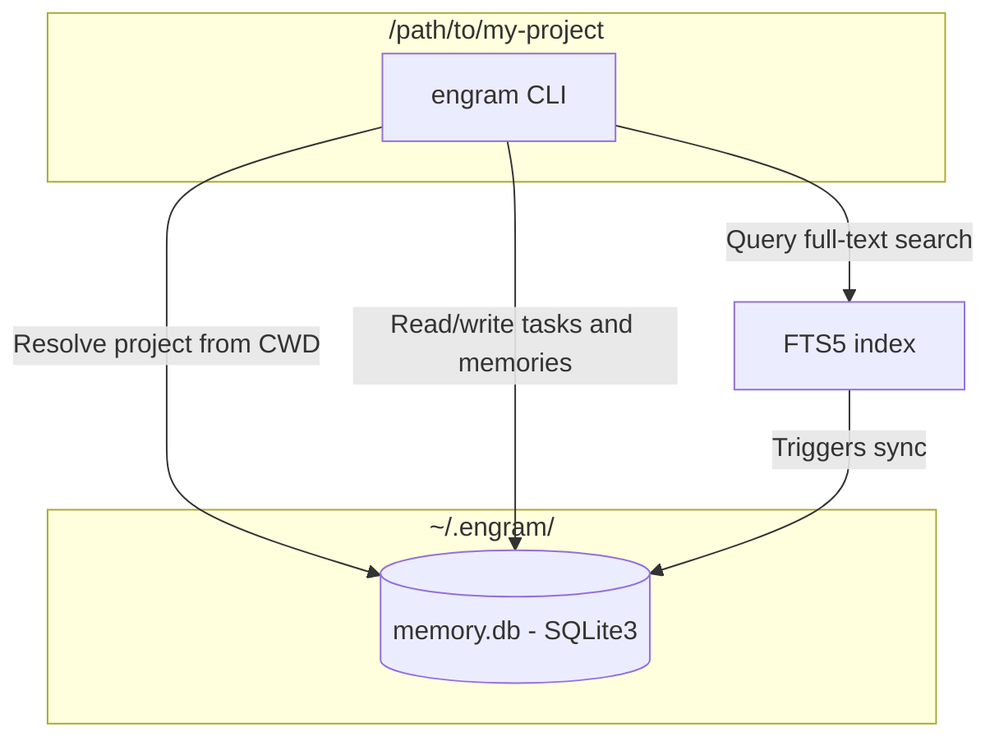

# Engram

> **Local-first, agent-agnostic persistent memory for AI coding assistants and developers.**

[](https://www.python.org/)
[](https://github.com/astral-sh/ruff)
[](https://opensource.org/licenses/MIT)

Engram is a small CLI that gives coding agents a durable local memory layer. It keeps project state, tasks, decisions, lessons, constraints, and reusable snippets in a central SQLite database at `~/.engram/memory.db`, while your repositories stay clean.

## The Problem

LLM coding agents are capable, but they usually lose important context between sessions:

1. **Short-term amnesia:** constraints, decisions, task state, and lessons have to be rediscovered.
2. **Context window pollution:** dumping all history into a prompt wastes tokens and makes agents less focused.

Engram solves this by giving agents one compact startup command plus searchable deeper context on demand.

```bash
engram context startup
```

## How It Works

Engram maps local repositories to projects in a user-level SQLite database. Commands resolve the current project from your working directory, so an agent can ask for current state without reading a pile of planning files.



## Phase-Task Hierarchy

Engram models planning as:

- **Project**: Repository-scoped workspace and memory boundary.
- **Phase**: A milestone inside a project (`planned`, `active`, `done`, `blocked`, `cancelled`).
- **Task**: Actionable work item linked to a phase through `phase_id`.

### Active Phase Selection in `engram start`

`engram start` resolves the current project and then selects work in this order:

1. Resume an `in-progress` task in the active phase (if one exists).
2. Pick the next actionable `todo` task in the active phase (`depends_on` satisfied, then priority order).
3. If no active-phase candidate exists, resume any other `in-progress` task in the project.
4. Otherwise, fall back to the project-level next actionable `todo` task.

Only one phase should be active per project. Use `engram phase start <phase_ref>` to activate a phase; Engram automatically demotes any other active phase in that project back to `planned`.

### Legacy `task.phase` Compatibility and Deprecation

Engram is migrating from legacy free-form phase strings (`task.phase`) to first-class phase links (`task.phase_id`).

- On DB initialization, legacy tasks with non-empty `task.phase` and null `phase_id` are backfilled: Engram creates or reuses matching phases per project and sets `phase_id`.
- During compatibility, workflow/display logic prefers `phase_id` (joined phase title) and falls back to legacy `task.phase` only when no valid `phase_id` is available.
- Task commands still accept legacy free-form phase text when no matching first-class phase is found, but this path is compatibility-only and should be treated as deprecated for new usage.

## Features

- Project-aware task tracking with `todo`, `in-progress`, `done`, `blocked`, and `cancelled` states.
- Persistent memories for notes, decisions, lessons, constraints, and snippets.
- Full-text search over memories using SQLite FTS5.
- Typed helper commands: `engram decision`, `engram lesson`, `engram constraint`, and `engram snippet`.
- Agent startup context via `engram context startup`.
- Task-specific context via `engram context task <id>`.
- Workflow commands: `engram start` and `engram finish`.
- Markdown exports for snapshots and handoffs.

## Installation

Clone the repository and install it locally with `uv`:

```bash
git clone https://github.com/Sai937593/engram.git
cd engram
uv pip install -e .
```

For development:

```bash
uv sync --extra dev
uv run pytest tests/ -v
```

## Quick Start

Initialize a project from the repository you want Engram to remember:

```bash
engram init --name "catalyst" --summary "Realtime lakehouse e-commerce platform"
```

Add and claim a task:

```bash
engram task add "Implement WAL mode" --priority high --acceptance "Concurrent reads and writes are covered by tests"
engram task next
engram task start <task_id>
```

Record knowledge while working:

```bash
engram decision add "Use SQLite FTS5" --content "FTS5 gives local full-text search without external services."
engram lesson add "Windows console encoding" --content "Configure stdout/stderr error handling before Rich output."
engram constraint add "Do not store secrets" --content "Secrets must stay in .env files, not tracked source."
engram task note <task_id> "Identified migration path for existing databases."
```

Resume context in a later session:

```bash
engram context startup
engram context task <task_id>
```

Finish the active task through Engram's workflow:

```bash
engram finish --type feat
```

## Common Commands

```bash
engram start                         # Claim the next task
engram finish --type docs            # Validate, commit, push, and mark the task done
engram task list --all               # Show all tasks
engram memory search "sqlite"        # Search project memory
engram export snapshot -o SNAPSHOT.md
engram export handoff -o HANDOFF.md
engram guide                         # Show the packaged manual
```

## Design Choices

- **Local first:** data stays in `~/.engram/memory.db`; no hosted service is required.
- **Agent agnostic:** the CLI works with any coding assistant that can run shell commands.
- **Search over prompt stuffing:** agents can retrieve compact startup context first, then search when details are needed.
- **Task-centered workflow:** task state, notes, acceptance criteria, and evidence are the durable handoff mechanism.

## Tradeoffs

- Engram does not sync automatically across machines.
- The current public package is CLI-only.
- The database is intentionally local and user-scoped, so teams need an explicit export or sync process if they want shared state.

## License

MIT. See [LICENSE](LICENSE).
