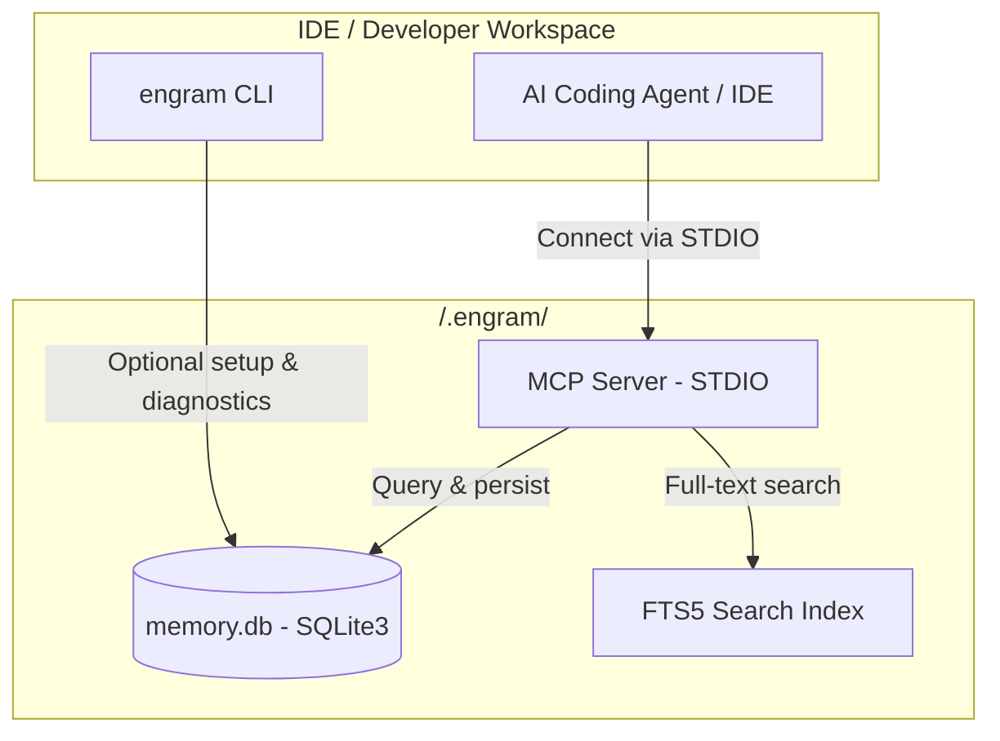

# Engram

> **Local-first, agent-agnostic persistent memory for AI coding assistants and developers.**

[](https://www.python.org/)
[](https://github.com/astral-sh/ruff)
[](https://opensource.org/licenses/MIT)
[](https://github.com/Sai937593/engram/actions/workflows/ci.yml)

Engram is a local-first, agent-agnostic persistent memory system for AI coding assistants and developers. It is built around a custom Model Context Protocol (MCP) server that exposes project-level memory, tasks, phases, and workflow tools directly to AI agents, with a trimmed companion CLI (`init`, `guide`, `db`) kept for optional human setup and diagnostics.

The current standardized workflow is documented in [ADR 0003](docs/adr/0003-workflow-standardization.md). Active implementation phases live in [docs/plans/plan-0003-workflow-standardization/implementation-phases.md](docs/plans/plan-0003-workflow-standardization/implementation-phases.md). Historical workflow docs are archived under [docs/archive/plan-0002-workflow-mvp-simplification/](docs/archive/plan-0002-workflow-mvp-simplification/) and should be treated as reference material only.

## Workflow Source

The simplified task loop remains:

```text
engram_workflow_start -> implement -> engram_workflow_verify -> engram_workflow_finish_and_commit
```

Workflow details that matter for agents:

- Phase lifecycle is `planned -> active -> review_pending -> done`.
- Task lifecycle is `open -> in_progress -> blocked -> done | cancelled`.
- Phased work uses branch names of the form `feat/<plan_key>-<phase_key>`.
- Unphased legacy work may fall back to `feat/misc`.
- Non-trivial tasks should keep a task plan at `.engram/task-plans/<plan_key>/<phase_key>/<task_key>/task-plan.md`.

## The Problem

LLM coding agents are highly capable, but they usually lose critical context between sessions:

1. Short-term amnesia: constraints, decisions, task state, and lessons have to be rediscovered every turn.
2. Context window pollution: dumping all history into a prompt wastes tokens and makes agents less focused.

Engram solves this by giving agents a local MCP connection to pull only the context they need dynamically, keeping their workspace and context windows optimized.


```mermaid
graph TD
    subgraph IDE / Developer Workspace
        Agent[AI Coding Agent / IDE]
        CLI[engram CLI]
    end

    subgraph Engram Architecture ["<repo>/.engram/"]
        MCPServer[MCP Server - STDIO]
        DB[(memory.db - SQLite3)]
        FTS5[FTS5 Search Index]
    end

    Agent -->|Connect via STDIO| MCPServer
    MCPServer -->|Query & persist| DB
    MCPServer -->|Full-text search| FTS5
    CLI -->|Optional setup & diagnostics| DB
```

## Features

- MCP-first architecture: exposes workflow, project, task, memory, and phase tools through the MCP server.
- Project-aware task tracking: programmatic task states (`open`, `in_progress`, `blocked`, `done`, and `cancelled`) mapped automatically to the current workspace.
- Phase lifecycle with review handoff: phases move through `planned`, `active`, `review_pending`, and `done`.
- Task-scoped relevant file path hints: faster startup navigation for agents without code parsing overhead.
- Persistent memories: categorized memories for notes, decisions, lessons, constraints, and reusable snippets.
- Full-text search: in-memory and SQLite FTS5 search index over all captured memories.
- Packaged user manual: interactive, console-rendered manual accessible via `engram guide` for human reference.

## Installation

Clone the repository and install it locally with `uv`:

```bash
git clone https://github.com/Sai937593/engram.git
cd engram
uv pip install -e ".[mcp]"
```

For development:

```bash
uv sync --extra dev
uv run pytest tests/ -v
```

## Quick Start

### 1. Initialize a Project

Run the initialization command from the repository root you want Engram to remember:

```bash
engram init --name "catalyst" --summary "Realtime lakehouse e-commerce platform"
```

### 2. Configure your MCP Client

Register `engram-mcp` with your agent client (Cursor, Codex, Claude Desktop, etc.). Supply the working directory as your initialized project root.

### 3. Agent Tool Interaction

Once connected, your agent will programmatically invoke MCP tools and resources to manage state and retrieve context.

**Retrieve Startup Context:**
The agent automatically reads the `engram://startup` resource to load the active project summary, active tasks, guardrails, and memory candidates.

**Claim and Start a Task:**
The agent calls `engram_workflow_start` to claim the next task, resolve the branch for the current plan and phase, and retrieve the packed context. For non-trivial tasks, the agent should create `.engram/task-plans/<plan_key>/<phase_key>/<task_key>/task-plan.md` before coding.

**Record Knowledge:**
During development, the agent captures critical decisions or constraints via `engram_memory_create`:

```json
{
  "title": "Use SQLite FTS5",
  "content": "FTS5 gives local full-text search without external services.",
  "type": "decision"
}
```

**Finish the Task:**
Once verification passes, the agent calls `engram_workflow_finish_and_commit` to commit and push already-staged verified changes and mark the task as done. If the task was the last unfinished item in a phase, the phase moves to `review_pending` and should be reviewed before phase completion.

---

## Admin and Utility Commands

The companion CLI is intentionally minimal and focused on optional human utilities:

```bash
engram init              # Initialize repo-local Engram state in the current repository
engram guide             # Open the interactive packaged User Manual
engram db                # Inspect repo-local database path, size, and integrity health
```

---

## Core MCP Surface

Engram exposes the following interface to connected AI agents:

### Resources
- `engram://startup` - Active project status, active tasks, guardrails, and memory candidates.
- `engram://task/{task_id}/context` - Detailed task context including requirements, acceptance criteria, and relevant memories.
- `engram://snapshot` - A full Markdown snapshot of all tasks, phases, and memories in the project.
- `engram://handoff` - A focused Markdown summary of recent achievements, active blockers, and planned next steps.

### Primary Tool Families
- Workflow: `engram_workflow_start`, `engram_workflow_verify`, `engram_workflow_finish_and_commit`, `engram_workflow_finish`
- Project: `engram_project_current`, `engram_project_init`, `engram_project_diagnostics`
- Tasks: `engram_task_list`, `engram_task_get`, `engram_task_next`, `engram_task_create`, `engram_task_create_many`, `engram_task_update`, `engram_task_note_append`, `engram_task_start`, `engram_task_done`, `engram_task_block`, `engram_task_unblock`, `engram_task_cancel`, `engram_task_retire`
- Memories: `engram_memory_list`, `engram_memory_get`, `engram_memory_create`, `engram_memory_update`, `engram_memory_update_many`, `engram_memory_delete`, `engram_memory_delete_many`, `engram_memory_search`
- Phases: `engram_phase_list`, `engram_phase_create`, `engram_phase_start`, `engram_phase_complete`, `engram_phase_update`, `engram_phase_cancel`, `engram_phase_archive`

## Design Choices

- Local first: normal project state is stored in repo-local SQLite at `.engram/memory.db`.
- Zero repository clutter: no planning files, task logs, or configuration blobs are committed to the codebase.
- On-demand context: agents pull specific details only when needed, minimizing prompt token consumption.

## License

MIT. See [LICENSE](LICENSE).
